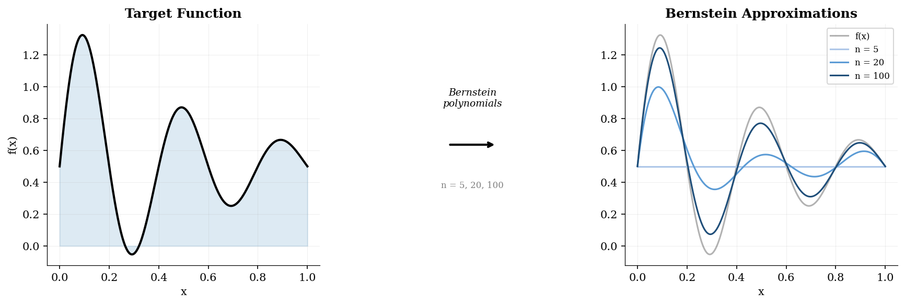
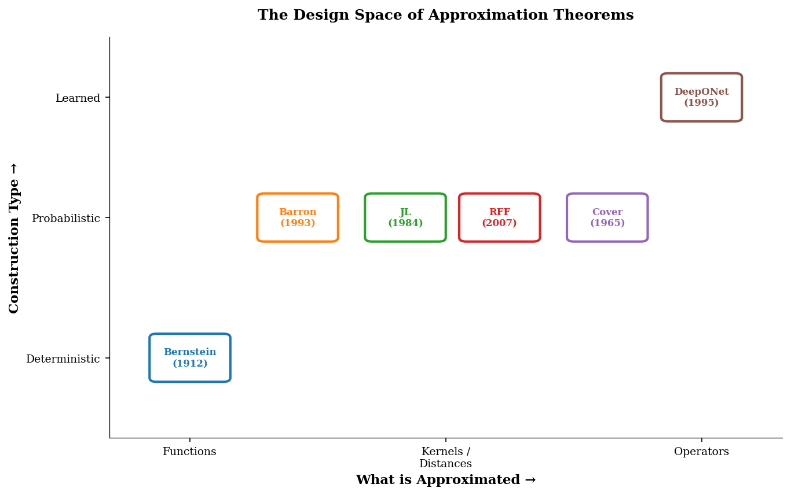

# nano-theorem

Six foundational approximation theorems, each proved in ~150 lines of NumPy.
No frameworks. No abstractions. Just the constructions.



Every method in machine learning rests on an approximation guarantee — a theorem
that says "a model of this form can get arbitrarily close to any target in this
class." These theorems are the load-bearing walls. Remove them and the whole
edifice is conjecture.

This repo implements six such guarantees. Not just states them — implements the
constructions. Read them in order and you'll see that the history of
approximation theory is a history of asking: *what can be approximated, and how?*

The through-line: **probabilistic sampling as a universal construction tool.**
Bernstein uses binomial sampling (1912). Barron uses Fourier spectral sampling
(1993). Johnson-Lindenstrauss uses Gaussian random projection (1984).
Rahimi-Recht uses frequency sampling from Bochner's measure (2007). The
recurring discovery: randomness is not an obstacle to approximation — it's the
mechanism.

```
uv run demo.py --theorem all
```

---

## 1. Bernstein / Weierstrass — The Origin

**The idea:** Sample f at equispaced nodes, weight by binomial probabilities.

```python
B_n(f; x) = Σ f(k/n) · C(n,k) · x^k · (1-x)^{n-k}    # → f(x) as n → ∞
```

Weierstrass (1885) proved that polynomials can approximate any continuous
function. Bernstein (1912) gave a constructive proof: evaluate f at k/n,
weight by the Binomial(n, x) mass function, and sum. The result is a polynomial
of degree n that converges uniformly to f.

The construction has a beautiful probabilistic interpretation: B_n(f; x) is
exactly E[f(S_n/n)] where S_n ~ Binomial(n, x). Approximation by polynomials
is approximation by expected values. This was the first hint that randomness
and approximation are deeply connected.

Convergence is O(1/√n) for Lipschitz functions — slow, but universal. No
assumptions on f beyond continuity.

[`theorems/bernstein.py`](theorems/bernstein.py)

***Polynomials approximate any continuous function, but convergence is O(1/√n)
and suffers the curse of dimensionality. Can neural networks do better?***

---

## 2. Barron — Dimension-Free Neural Approximation

**The idea:** Sample random neurons from the spectral measure, assign prescribed weights.

```python
f_N(x) = (C_f/N) · Σ_{i=1}^{N} sin(ω_i · x),  ω_i ~ μ(ω) ∝ |f̂(ω)|
```

Barron (1993) proved the most important result in neural network theory: for
functions with finite Fourier moment C_f = Σ|f̂(ω)|, a single-hidden-layer
network with N random neurons achieves ‖f_N - f‖ ≤ C_f / √N. The rate is
O(1/√N) regardless of input dimension — neural nets beat the curse of
dimensionality.

The proof is constructive via Maurey's empirical sampling lemma: represent f
as an expectation over the spectral measure μ(ω) ∝ |f̂(ω)|, then approximate
the expectation by sampling N neurons from μ. Each neuron gets a prescribed
weight C_f/N — no optimization needed. The random construction converges.

This is why neural networks work in high dimensions: the approximation rate
depends on the Fourier smoothness of f (encoded in C_f), not on the number
of input variables.

[`theorems/barron.py`](theorems/barron.py)

***Neural nets achieve dimension-free rates — but the proof requires knowing the
Fourier transform. Does randomness help in geometry too?***

---

## 3. Johnson-Lindenstrauss — Random Projections Preserve Geometry

**The idea:** Multiply by a random Gaussian matrix, normalize.

```python
f(x) = (1/√k) · R · x,    R[i,j] ~ N(0,1),    k = O(log n / ε²)
```

Johnson and Lindenstrauss (1984) proved that n points in R^d can be projected
to R^k with k = O(log n / ε²) while preserving all pairwise distances within
factor (1 ± ε). The construction is absurdly simple: a random Gaussian matrix.

The theorem says geometry in high dimensions is compressible. You have 500
points in R^1000? Project to R^50 with a random matrix and every distance is
preserved to within 30%. The target dimension depends only on how many points
you have and how much distortion you tolerate — not on the original dimension.

This is the mathematical justification for dimensionality reduction. PCA finds
the "best" subspace; JL says a random one is almost as good.

[`theorems/jl.py`](theorems/jl.py)

***Random projections preserve distances. But can random projections preserve
function evaluation — the kernel trick without the kernel?***

---

## 4. Random Fourier Features — Barron Made Practical

**The idea:** Sample frequencies from the kernel's spectral measure, use cosine features.

```python
z(x) = √(2/D) · [cos(ω₁·x + b₁), ..., cos(ω_D·x + b_D)]
z(x)·z(y) ≈ k(x - y)    # inner product approximates the kernel
```

Rahimi and Recht (2007) connected Bochner's theorem (1933) to machine learning.
Bochner says: every shift-invariant positive-definite kernel k(x-y) is the
Fourier transform of a non-negative measure p(ω). So sample frequencies from
p(ω), form cosine features, and their inner products approximate k(x-y).

This turns kernel methods into linear methods. Instead of computing the N×N
kernel matrix (O(N²) space, O(N³) to solve), compute D random features per
point and solve a D-dimensional linear system. When D << N, this is
dramatically faster.

The connection to Barron is direct: Barron samples neurons from the target
function's spectral measure to approximate the function. Rahimi-Recht samples
neurons from the kernel's spectral measure to approximate the kernel. Same
construction, different target.

[`theorems/rff.py`](theorems/rff.py)

***Random features approximate kernels. But why does mapping to high dimensions
help? What's the geometry?***

---

## 5. Cover — The Geometry of Separability

**The idea:** Count the fraction of dichotomies that a hyperplane can realize.

```python
P(N, d) = (1/2^{N-1}) · Σ_{k=0}^{d-1} C(N-1, k)    # → 1 as d/N → ∞
```

Cover (1965) answered a fundamental question: given N random points in R^d with
random binary labels, what is the probability that they are linearly separable?
The answer is an exact combinatorial formula that exhibits a sharp phase
transition at d = N/2.

Below d = N/2, almost no random labeling is separable. Above d = N/2, almost
all of them are. At d = N, the probability is exactly 1.

This is the geometry behind the kernel trick. When you map data from R^d to a
higher-dimensional feature space R^D, Cover's theorem tells you that the data
becomes linearly separable — not because the kernel found clever features, but
because of a combinatorial inevitability. High dimensions make things separable.

[`theorems/cover.py`](theorems/cover.py)

***High dimensions make functions separable. But all of this approximates
functions (inputs → numbers). What about operators — maps from functions to
functions?***

---

## 6. Chen & Chen / DeepONet — From Functions to Operators

**The idea:** Decompose into branch (reads input function) × trunk (evaluates output).

```python
G(u)(y) ≈ Σ_k branch_k(u(x₁),...,u(x_m)) · trunk_k(y)
```

Chen and Chen (1995) proved the universal approximation theorem for operators:
a neural network with a branch net (processing sensor values of the input
function) and a trunk net (processing the evaluation coordinate) can approximate
any continuous nonlinear operator to arbitrary accuracy.

This is the theoretical foundation of DeepONet (Lu et al., 2021) and the bridge
to [nano-operator](https://github.com/lengoaviad/nano-operator). While Barron
tells you that networks can approximate functions, Chen & Chen tells you they
can approximate the maps between function spaces — the operators that define
physics itself.

The implementation trains a minimal DeepONet on the antiderivative operator:
G(u)(y) = ∫₀ʸ u(s)ds. The branch network reads the input function u at m
sensor points; the trunk network processes the evaluation point y; their dot
product predicts the antiderivative. Simple architecture, strong theoretical
backing.

[`theorems/deeponet.py`](theorems/deeponet.py)

---

## The Design Space



| # | Theorem | Year | Approximates | Construction | Rate |
|---|---------|------|-------------|--------------|------|
| 1 | Bernstein / Weierstrass | 1912 | Continuous functions | Binomial sampling | O(1/√n) |
| 2 | Barron | 1993 | Smooth functions | Fourier spectral sampling | O(1/√N) dim-free |
| 3 | Johnson-Lindenstrauss | 1984 | Pairwise distances | Gaussian random projection | (1±ε) with k=O(log n/ε²) |
| 4 | Rahimi-Recht / Bochner | 2007 | Shift-invariant kernels | Spectral frequency sampling | O(1/√D) |
| 5 | Cover | 1965 | Linear separability | Combinatorial counting | Phase transition at d=N/2 |
| 6 | Chen & Chen | 1995 | Nonlinear operators | Branch-trunk decomposition | Universal |

---

## The Theorems We Left Out

**Cybenko (1989)** proved that single-hidden-layer networks with sigmoidal
activations are universal approximators. But the proof uses the Hahn-Banach
theorem — it's an existence proof, not a construction. There's nothing to
implement. Barron's theorem is strictly stronger: it gives the same universality
plus a convergence rate plus a construction.

**Kolmogorov's superposition theorem (1957)** resolved Hilbert's 13th problem
by showing that every continuous function of d variables can be written as
a composition of continuous functions of one variable. Intellectually the
deepest result in this space, and the theoretical ancestor of KANs
(Kolmogorov-Arnold Networks). But the inner functions are fractal-like;
constructive versions (Sprecher, 1965) are extremely delicate — not suitable
for a clean 150-line demo.

**Hornik et al. (1989)** proved universal approximation for networks with
arbitrary bounded non-constant activation functions. Same limitation as
Cybenko: non-constructive. The proof goes through the Stone-Weierstrass theorem,
which is itself non-constructive.

---

## What Comes Next

This is the third repo in a trilogy:

- [**nano-solver**](https://github.com/lengoaviad/nano-solver) — *how to solve:* six classical numerical methods
- [**nano-operator**](https://github.com/lengoaviad/nano-operator) — *how to learn:* neural operator architectures
- **nano-theorem** — *why it works:* the approximation guarantees

The connection is direct. Theorem 2 (Barron) explains why the networks in
nano-operator can learn. Theorem 6 (Chen & Chen) is the theoretical foundation
of DeepONet, which is implemented as a full operator-learning architecture in
nano-operator. And the classical solvers in nano-solver generate the training
data that makes operator learning possible.

---

## Quickstart

```bash
# Clone and run
git clone https://github.com/lengoaviad/nano-theorem.git
cd nano-theorem
uv run demo.py --theorem all

# Individual theorems
uv run demo.py --theorem bernstein
uv run demo.py --theorem barron
uv run demo.py --theorem deeponet
```

Requires Python ≥ 3.12 and [uv](https://docs.astral.sh/uv/).

---

## References

1. Bernstein, S. N. "Démonstration du théorème de Weierstrass fondée sur le calcul des probabilités." *Comm. Kharkov Math. Soc.*, 1912.
2. Barron, A. R. "Universal approximation bounds for superpositions of a sigmoidal function." *IEEE Trans. Information Theory*, 39(3), 1993.
3. Johnson, W. B. and Lindenstrauss, J. "Extensions of Lipschitz mappings into a Hilbert space." *Contemp. Math.*, 26, 1984.
4. Rahimi, A. and Recht, B. "Random Features for Large-Scale Kernel Machines." *NeurIPS*, 2007.
5. Cover, T. M. "Geometrical and Statistical Properties of Systems of Linear Inequalities with Applications in Pattern Recognition." *IEEE Trans. Electronic Computers*, EC-14(3), 1965.
6. Chen, T. and Chen, H. "Universal approximation to nonlinear operators by neural networks with arbitrary activation functions and its application to dynamical systems." *IEEE Trans. Neural Networks*, 6(4), 1995.
7. Lu, L. et al. "Learning nonlinear operators via DeepONet based on the universal approximation theorem of operators." *Nature Machine Intelligence*, 3, 2021.
8. Cybenko, G. "Approximation by superpositions of a sigmoidal function." *Mathematics of Control, Signals and Systems*, 2(4), 1989.
9. Kolmogorov, A. N. "On the representation of continuous functions of many variables by superposition of continuous functions of one variable and addition." *Doklady Akademii Nauk SSSR*, 114, 1957.

---

MIT License · 2026 · [Aviad Lengo](https://github.com/lengoaviad)
